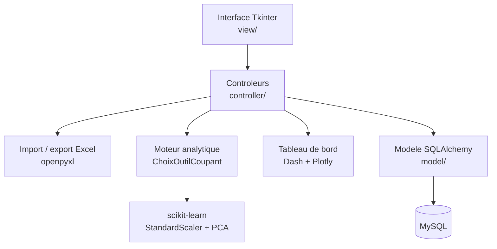
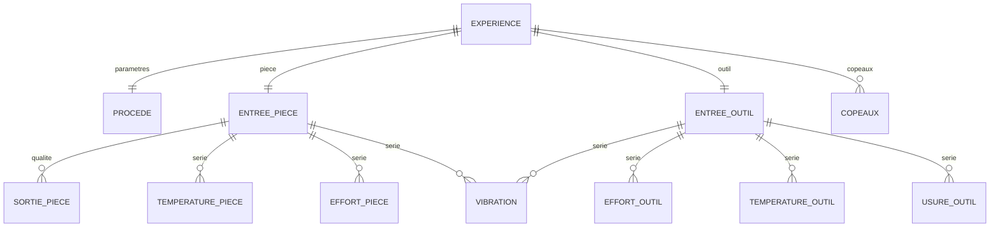
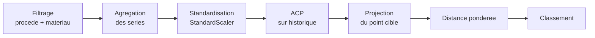

# Architecture et spécifications techniques

Ce document décrit le modèle de données d'usinage, la chaîne de traitement
analytique et l'algorithme de recommandation par similarité.

---

## 1. Vue d'ensemble

L'application suit une organisation Modèle – Vue – Contrôleur.



| Couche | Répertoire | Rôle |
| --- | --- | --- |
| Vue | `view/` | fenêtres Tkinter, formulaires de saisie, pages de résultats |
| Contrôleur | `controller/` | logique applicative, import/export Excel, moteur de recommandation |
| Modèle | `model/` | entités SQLAlchemy, session partagée |
| Utilitaires | `utils.py` | distance pondérée, transformation d'efforts, évaluateur d'expressions |
| Configuration | `config.py` | lecture de `.env`, construction de l'URI SQLAlchemy |

---

## 2. Modèle de données

Une expérience d'usinage est éclatée en douze tables, selon que la mesure porte sur
le **procédé**, la **pièce** ou l'**outil**.



### Pourquoi ce découpage

| Groupe | Tables | Nature |
| --- | --- | --- |
| Conditions d'essai | `procede`, `entree_piece`, `entree_outil` | une ligne par expérience — paramètres fixés par l'opérateur |
| Séries temporelles | `effort_piece`, `effort_outil`, `temperature_piece`, `temperature_outil`, `usure_outil`, `vibration` | N lignes par expérience — mesures échantillonnées dans le temps |
| Résultats | `sortie_piece`, `copeaux` | qualité obtenue après usinage |

Les efforts et températures sont des **signaux**, pas des scalaires : un essai
produit des centaines de relevés. Les stocker dans la table d'expérience aurait
imposé soit une agrégation prématurée, soit des colonnes en nombre variable.

`vibration` a une clé primaire composite `(id_entree_piece, id_entree_outil,
temps_vibration)` : une vibration naît de l'interaction entre une pièce et un outil,
elle n'appartient à aucun des deux seul.

---

## 3. Chaîne de traitement analytique



### Étape 1 — Filtrage

Seules les expériences partageant le **procédé** et le **matériau** de la cible sont
retenues. Comparer un fraisage d'aluminium à un tournage d'Inconel n'aurait aucun
sens physique.

### Étape 2 — Agrégation des séries

Chaque série temporelle est réduite à son **extremum**, qui est la grandeur
dimensionnante en usinage : c'est l'effort maximal qui casse l'outil, la température
maximale qui dégrade le revêtement.

| Variable | Source | Agrégat |
| --- | --- | --- |
| Effort de coupe | `effort_outil` (fx, fy, fz) | norme du vecteur maximal |
| Température outil | `temperature_outil` | maximum |
| Usure en dépouille VB | `usure_outil` | maximum |
| Rugosité Ra | `sortie_piece` | maximum |
| Amplitude vibratoire | `vibration` | maximum |
| Temps d'usinage | `usure_outil` | maximum |

### Étape 3 — Standardisation

Les grandeurs sont hétérogènes : un effort se compte en milliers de newtons, une
usure en centièmes de millimètre. Sans standardisation, l'ACP serait entièrement
pilotée par l'effort, du seul fait de son ordre de grandeur.

```python
scaler = StandardScaler()
historical_scaled = scaler.fit_transform(historical_df)
user_scaled = scaler.transform(user_df)
```

### Étape 4 — ACP ajustée sur l'historique seul

**Point méthodologique important.** Le `StandardScaler` et l'ACP sont ajustés
**uniquement sur les expériences historiques**. Le point cible est ensuite
`transform`é dans cet espace déjà figé.

Inclure le point utilisateur dans l'ajustement le laisserait influencer les axes
qui servent ensuite à le comparer — le résultat dépendrait de la question posée.
C'est le même principe qu'un `fit` réservé au jeu d'entraînement.

### Étape 5 — Distance euclidienne pondérée

Le classement utilise une distance pondérée par la **part de variance expliquée**
de chaque composante :

```python
def get_distance(p, q, coef_tab):
    sum_sq = 0
    for p_i, q_i, coeff_i in zip(p, q, coef_tab):
        sum_sq += coeff_i * ((p_i - q_i) ** 2)
    return sum_sq ** 0.5
```

$$d(u, e) = \sqrt{\sum_{k} \lambda_k \,(u_k - e_k)^2}$$

où $\lambda_k$ est la part de variance expliquée par la composante $k$. Un écart sur
un axe structurant pèse davantage qu'un écart sur un axe résiduel — sans quoi les
dernières composantes, essentiellement du bruit, compteraient autant que la
première.

Les dix expériences les plus proches sont affichées.

### Ce que la méthode n'est pas

C'est une **recherche par similarité**, pas un modèle prédictif. Elle ne prédit ni
la rugosité ni la durée de vie de l'outil : elle retrouve les essais déjà réalisés
dont le comportement mesuré ressemble le plus à la cible. Il n'y a ni apprentissage
supervisé, ni métrique de généralisation à rapporter.

---

## 4. Interprétation des axes sur le jeu de démonstration

Sur les 60 expériences synthétiques, les deux premiers axes portent **61,6 %** de la
variance :

| Variable | PC1 | PC2 |
| --- | ---: | ---: |
| Usure en dépouille VB | **+0,78** | −0,23 |
| Température outil | **+0,66** | −0,51 |
| Effort de coupe | **−0,71** | −0,37 |
| Rugosité Ra | **−0,68** | −0,47 |
| Amplitude vibratoire | +0,23 | **−0,70** |
| Temps d'usinage | +0,14 | **+0,72** |

**PC1 oppose deux régimes de coupe.** À droite, les essais rapides et chauds : usure
et température élevées. À gauche, les essais lourds et lents : efforts et rugosité
élevés. C'est l'arbitrage classique entre productivité et durée de vie de l'outil.

**PC2 oppose durée d'usinage et sollicitation dynamique** : les essais longs et
calmes en haut, les essais courts et vibrants en bas.


---

## 5. Sécurité — évaluateur d'expressions

L'application permet de saisir des formules de conversion. La version d'origine les
évaluait avec `eval()`, ce qui exécute n'importe quel code Python.

L'évaluateur a été remplacé par `safe_math_expression`, restreint aux fonctions
mathématiques. Un test vérifie explicitement le rejet d'une tentative d'exécution :

```python
def test_safe_math_expression_rejects_code_execution():
    with pytest.raises(ValueError):
        safe_math_expression("__import__('os').system('echo nope')", 1)
```

Toutes les requêtes SQL sont paramétrées ; aucune valeur utilisateur n'est
concaténée dans une requête.

---

## 6. Données de démonstration

Les mesures d'origine proviennent d'un partenariat avec le département Génie
mécanique de l'université de Tours et ne sont pas redistribuables.

`scripts/generate_demo_experiments.py` produit un jeu de substitution qui respecte
les **lois physiques de la coupe**, et non du bruit aléatoire :

| Grandeur | Loi utilisée |
| --- | --- |
| Effort de coupe | Kienzle — $F_c = k_{c1} \cdot a_p \cdot f_z^{\,1-m_c}$ |
| Rugosité théorique | $R_a \approx f_z^2 / (32 \cdot r_\varepsilon)$, dégradée par l'usure |
| Usure en dépouille | Taylor — $VB \propto (V_c/V_{ref})^{1{,}7} \cdot t^{0{,}35}$, réduite par le revêtement |
| Température | croissante avec $V_c$ et la dureté, atténuée par la lubrification |
| Vibration | croissante avec l'engagement radial et l'élancement de l'outil |

Un bruit multiplicatif de 5 % évite un alignement parfait sur les lois, qui
concentrerait toute la variance sur le premier axe.

**Une nuance honnête sur ces données** : la corrélation marginale entre usure VB et
rugosité ressort *négative* (r ≈ −0,30) alors que le modèle générateur applique bien
un effet positif (`ra *= 1 + 2.2 * vb`). C'est un effet de confusion classique :
l'avance par dent domine la rugosité, et les essais à forte usure sont aussi ceux à
faible avance. L'effet causal est positif, l'association observée ne l'est pas.

---

## 7. Limites connues

- **Aucune évaluation de la qualité des recommandations.** Sans jeu de référence
  annoté, on ne peut pas mesurer si les essais proposés sont réellement les plus
  pertinents pour un usineur.
- **Les mesures manquantes sont remplacées par une valeur neutre**, ce qui rapproche
  artificiellement du centre les expériences incomplètes.
- **Couverture de tests faible** : les tests portent sur les utilitaires numériques
  et l'évaluateur d'expressions, pas sur le moteur de recommandation.
- **`DashboardController.py` fait 1 176 lignes** et mélange accès aux données et
  présentation. Une couche d'accès dédiée faciliterait les tests.
- **Nommage mixte français/anglais** hérité du prototype académique.
