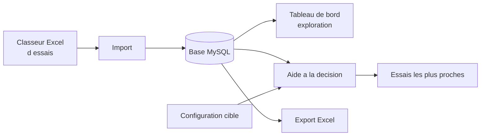
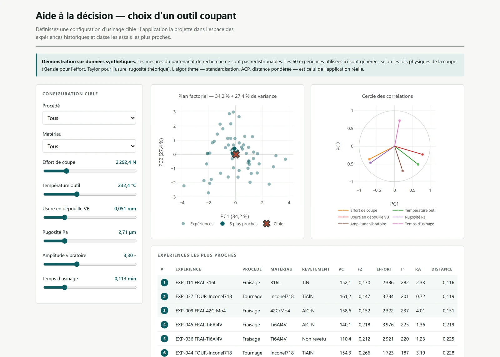

# Guide d'utilisation

L'application sert deux usages distincts : **archiver** des campagnes d'essais
d'usinage, et **exploiter** cet historique pour choisir une configuration d'outil.

---

## Vue d'ensemble

---

## 1. Importer une campagne d'essais

**Menu → Importer une expérience**

Le classeur attendu est fourni : `templates/experiment_template.xlsx`. Il comporte
un onglet par famille de mesures.

| Onglet | Contenu | Nature |
| --- | --- | --- |
| Procédé | type d'opération, assistance, Vc, avance, profondeur de passe | une ligne |
| Pièce | matériau, procédé d'élaboration, longueur usinée | une ligne |
| Outil | type, diamètre, nombre de dents, revêtement, angles | une ligne |
| Efforts | fx, fy, fz horodatés | série temporelle |
| Températures | relevés horodatés | série temporelle |
| Usure | VB, Er, Kt en fonction du temps d'usinage | série temporelle |
| Vibrations | fréquence et amplitude horodatées | série temporelle |
| Copeaux, Sortie pièce | épaisseur, rugosité, dureté, contrainte résiduelle | une ligne |

Les onglets de série acceptent autant de lignes que nécessaire : l'application
n'agrège qu'au moment de l'analyse.

> **Les efforts mesurés à la pièce sont convertis dans le repère de l'outil.** Un
> dynamomètre mesure dans le repère de la table ; l'outil tourne. La conversion
> (`utils.convert_effort`) applique la rotation correspondante — un test vérifie
> qu'elle **préserve la norme du vecteur**, ce qui est la propriété attendue d'une
> rotation.

---

## 2. Explorer les essais

**Menu → Tableau de bord**

Le tableau de bord Plotly/Dash affiche les signaux d'une expérience : efforts,
températures, usure et vibrations en fonction du temps, ainsi que les paramètres de
coupe associés.

C'est la vue à utiliser pour contrôler un essai après import, avant de l'intégrer à
l'historique exploité par l'aide à la décision.

---

## 3. Aide à la décision

**Menu → Choix de l'outil coupant**

### Étape 1 — restreindre le périmètre

Choisissez le **procédé** (fraisage, tournage, perçage) et le **matériau**. Seules
les expériences partageant ce couple sont comparées : rapprocher un fraisage
d'aluminium d'un tournage d'Inconel n'aurait pas de sens physique.

Si aucune expérience ne correspond, l'application le signale explicitement plutôt
que de renvoyer un résultat vide.

### Étape 2 — décrire la configuration visée

Renseignez les grandeurs que vous cherchez à obtenir ou à ne pas dépasser :

| Grandeur | Unité |
| --- | --- |
| Effort de coupe | N |
| Température outil | °C |
| Usure en dépouille VB | mm |
| Rugosité Ra | µm |
| Amplitude vibratoire | — |
| Temps d'usinage | min |

Les grandeurs laissées vides sont remplacées par une valeur neutre. C'est une
limite assumée : une expérience incomplète est artificiellement rapprochée du
centre du nuage.

### Étape 3 — lire le résultat

L'application affiche le **plan factoriel** de l'ACP, où chaque point est une
expérience et la croix votre configuration cible, ainsi que la liste des
**dix essais les plus proches** avec leurs paramètres de coupe et l'outil employé.

Dans la démo web, choisissez **ACP 2D** ou **ACP 3D**, faites tourner le nuage et
cliquez sur un point pour afficher les six écarts à la cible. Les cinq voisins sont
mis en évidence ; le classement est calculé dans les six dimensions et ne change
pas avec la vue. La matrice Pearson montre les corrélations du sous-ensemble filtré.
L’éboulis de variance indique la part d’information masquée par la projection.

Les scénarios de départ utilisent le centre de l’historique ou un essai du jeu filtré
à faible rugosité / temps court. Ils n’optimisent pas des paramètres de coupe.
Le classement peut être exporté en CSV avec ses distances et ses mesures.

### Comment lire une recommandation

Les essais proposés sont ceux dont le **comportement mesuré** ressemble le plus à
votre cible. L'application ne prédit rien : elle retrouve des précédents. La
décision reste à l'usineur, qui dispose du contexte que la base ne contient pas.

Une distance faible signifie « un essai comparable a déjà été réalisé, voici ses
paramètres ». Une distance élevée sur les dix résultats signifie que votre
configuration sort du domaine couvert par l'historique — l'information est utile en
soi.

---

## 4. Exporter une expérience

**Menu → Exporter une expérience**

Régénère un classeur Excel au format d'import, écrit dans `downloads/`. Utile pour
transmettre un essai ou l'archiver hors base.

---

## Démonstration sans installation

`demo/index.html` reproduit l'étape 3 dans le navigateur, sur données synthétiques,
sans MySQL ni Tkinter. Les curseurs recalculent en direct la projection du point
cible et le classement — c'est le même algorithme, réimplémenté en JavaScript à
partir du modèle ajusté en Python.
